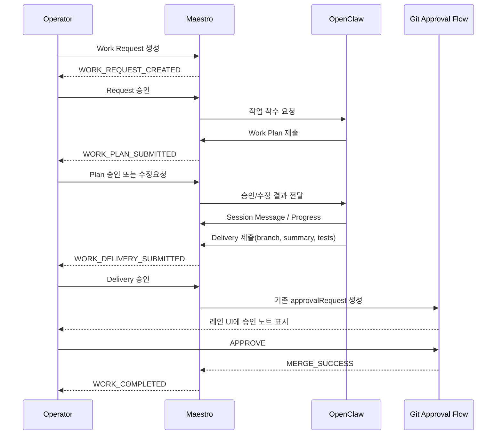

# OpenClaw Integration MVP Architecture

기준일: 2026-03-14
대상 트랙: `VU-001`

## 1. 설계 목표

OpenClaw 연동 MVP의 목적은 Maestro를 `작업 승인 전 관제`까지 확장하되, 현재 검증된 결과 승인 경로를 깨지 않는 것이다.

아키텍처 원칙은 다음 5가지다.

1. 기존 `merge approval` 흐름을 유지한다.
2. 신규 워크플로우는 `WORK_*` 도메인으로 격리한다.
3. OpenClaw 장애가 기존 Maestro 운영을 멈추게 해서는 안 된다.
4. 운영자는 항상 수동 개입과 최종 승인 권한을 가진다.
5. 초기 MVP는 단일 운영자 기준으로 시작한다.

## 2. 현재 구조와 목표 구조

### 현재

- Agent -> `POST /api/request` -> Maestro Server
- Maestro Server -> WebSocket broadcast -> Dashboard
- Dashboard -> `APPROVE / REJECT / UNDO`
- Maestro Server -> `git merge` or `git reset --hard HEAD~1`

### 목표

- Operator -> Work Request 등록
- Maestro -> OpenClaw에 착수/계획 요청
- OpenClaw -> Work Plan / Message / Delivery 전송
- Operator -> Request / Plan / Delivery에 단계별 승인
- Delivery 승인 -> 기존 Maestro merge approval로 브리지

## 3. 제안 컴포넌트

### A. Work Intake Layer

- 역할: 작업 요청 생성, 우선순위 부여, 프로젝트/레인 배정
- 입력: 운영자 수동 입력 또는 외부 시스템 webhook
- 출력: `WorkRequest` 엔티티 생성

### B. Workflow Store

- 역할: `WorkRequest`, `WorkPlan`, `WorkSession`, `WorkMessage`, `WorkDelivery`, `WorkDecision` 저장
- MVP 저장 전략:
  - 메모리 맵 + 링버퍼 조회
  - 경량 append-only JSONL 또는 JSON 파일 영속화
- 이유: 현재 서버 구조와 맞고, 외부 DB 없이도 파일럿 운영이 가능하다.

### C. OpenClaw Connector

- 역할: Maestro와 OpenClaw 사이의 계약 계층
- 책임:
  - OpenClaw 작업 시작 호출
  - OpenClaw 콜백 수신
  - 외부 세션 ID와 Maestro 세션 ID 매핑
  - 재시도/타임아웃/연결 상태 기록

### D. Decision Engine

- 역할: 사람의 단계별 결정(`approve / reject / revise / ask`)을 상태 전이로 반영
- 특성:
  - 요청 승인과 결과 승인 로직을 분리
  - 기존 `APPROVE / REJECT / UNDO`는 Delivery 이후에만 사용

### E. Delivery Bridge

- 역할: Work Delivery를 기존 승인 파이프라인으로 승격
- 원칙:
  - 최종 머지는 기존 승인 엔진에서만 실행
  - Work Delivery는 머지 가능한 승인 요청으로 변환될 뿐, 직접 머지하지 않는다.

### F. Work Console UI

- 역할: Request/Plan/Session/Delivery를 보는 별도 패널
- 기존 레인 UI와의 관계:
  - 레인 UI는 Delivery 승인용으로 유지
  - 신규 Work 패널은 작업 계약과 대화 문맥을 담당

## 4. 권장 시퀀스

## 5. 상태 기계

### WorkRequest 상위 상태

- `submitted`
- `request_approved`
- `request_rejected`
- `plan_review`
- `execution`
- `delivery_review`
- `completed`
- `returned`
- `cancelled`

### 왜 상위 상태가 필요한가

- 운영자는 한 화면에서 전체 진행 상황을 빠르게 봐야 한다.
- 세부 상태는 각 하위 엔티티가 관리하되, 대시보드 카드 정렬과 필터는 상위 상태 하나로 처리하는 편이 단순하다.

## 6. 기존 Maestro와의 연결점

### 그대로 유지할 것

- 프로젝트 registry 및 활성 프로젝트 전환
- 레인 수(`1~8`)와 레인 시각화
- 기존 `/api/request`
- WebSocket 기반 승인 이벤트
- `APPROVE / REJECT / UNDO`
- 승인 이력과 운영 패널

### 새로 추가할 것

- `/api/work-*` REST 계층
- `WORK_*` WebSocket 이벤트
- Work 패널 UI
- OpenClaw connector 설정
- 세션/메시지/계획/결정 저장

## 7. 권장 저장 전략

MVP에서는 외부 DB를 바로 붙이지 않는다.

- 런타임 조회: 메모리 맵
- 재시작 복구: `.maestro-workflows.json` 또는 `.maestro-worklog.jsonl`
- 보존 범위:
  - 열린 WorkRequest
  - 최근 N개 closed request
  - 각 request의 최신 plan, recent messages, latest delivery

이 전략은 현행 Maestro의 메모리 중심 구조와 충돌이 적고, 파일럿 단계 운영에 충분하다.

## 8. 실패 시 동작

### OpenClaw 연결 실패

- 요청은 `request_approved` 또는 `plan_review` 상태에 머무른다.
- 운영자는 재시도 또는 취소를 수행할 수 있어야 한다.
- 기존 결과 승인 기능은 영향받지 않는다.

### Delivery 브리지 실패

- WorkDelivery는 `submitted` 상태를 유지한다.
- 기존 승인 노트 생성 실패 사유를 운영자에게 노출한다.
- 머지 자체는 실행하지 않는다.

### 서버 재시작

- 열린 WorkRequest와 최신 상태를 복구한다.
- 복구 불가한 외부 세션은 `needs_reconnect`로 표시한다.

## 9. 구현 순서 제안

1. `WORK_*` 데이터 저장/조회 계층 추가
2. Work Request 생성/승인 API + UI
3. OpenClaw connector 초안 및 callback 계약
4. Work Plan 제출/승인 API
5. Session message 이력
6. Delivery -> 기존 approvalRequest 브리지
7. 운영 패널/히스토리 확장

## 10. MVP 이후 확장

- 다중 운영자 동시 편집 제어
- 세션 검색/필터/아카이브
- 승인 정책과 Work Request 정책의 분리
- 외부 tracker(Jira, GitHub Issues) 연동
- 역할 기반 접근 제어
